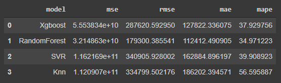

# Predicting house prices using machine learning algorithms

This project aims to set up a machine learning model that predicts real estate prices by area.
Then, this model will be used subsequently to predict the price of a house based on several characteristics given by the user via a simple web interface.

The present project has 3 major parts:
1.  datasets -- This is where our dataset is located.
2.  test_technique.ipynb -- This file contains code for several machine learning algorithms. After fitting these algorithms and evaluating them, it turns out that the RandomForest model was the best model. 
3.  model -- This folder contains our model.
3.  app.py -- This contains Flask APIs that receives house characteristics, computes the predicted price based on machine learning model and returns it.
4.  Templates -- This folder contains the HTML template.

## Machine learning models
Different machine learning algorithms were tested.
  -  Xgboost
  -  Random Forest
  -  SVR
  -  K-Neighbors Regressor

After comparing the different models models, it turned out that the Random Forest one has the best results.

  

## How to execute?

Firstly we create a folder in google drive ("Test Technique__Imen TRABELSI"). Inside this folder, we create two other folders ("datasets" and "model"). We upload the files ("Data - Test technique PFE 8.xlsx" and "mer positions") inside the "datasets" folder.
Then, we run "test_technique.ipynb" on google colaboratory.
The model will be saved to the "model" folder.

Now, for the web interface, I used PyCharm as a working environment. To run the "app.py". A new project is to be created. This project has the following structure:

    Project __ model__model.pkl
           |__ static__style.css
           |__ templates__main.html
           |__ app.py

Before running the "app.py" file, install the pre-requisite libraries (requirements.txt)

## Build with 

 - Python 
 - Flask -- The web framework used

